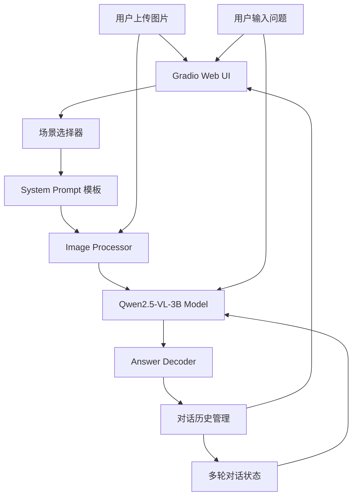

# 基于 VLM 的智能图文问答助手

## 摘要

本文构建了一个基于 Qwen2.5-VL-3B 视觉语言模型的智能图文问答助手，支持自然场景图片和文档/幻灯片截图两类图像的中文问答与多轮对话。系统采用 transformers 推理框架，使用 Gradio 构建 Web 交互界面，在 VQA-v2 验证集子集上进行了定量评测。在 200 条评测样本上取得 18% 的整体准确率，其中计数类问题表现突出（66.7%）。本文对错误类型进行了系统分类分析，并对模型的局限性和改进方向进行了讨论。

**关键词：** 视觉语言模型；视觉问答；Qwen2.5-VL；多模态理解；Gradio

---

## 1 引言

### 1.1 任务背景

视觉问答（Visual Question Answering, VQA）是计算机视觉与自然语言处理交叉领域的核心任务之一。给定一张图片和一个自然语言问题，系统需要同时理解图像内容和文本语义，并通过跨模态推理给出准确答案。随着大规模视觉语言模型（VLM）的快速发展，基于预训练 VLM 构建的图文问答系统在电商导购、文档审阅、辅助教学等场景展现出广泛的应用前景。

### 1.2 任务定义

本项目的目标是构建一个"看图/看文档能聊天"的多模态助手，具体包括：

1. **多场景支持**：覆盖自然场景（商品图、日常照片）和文档/幻灯片（讲义截图、表格）两类图像；
2. **中文问答**：输入输出均为中文，要求回答准确、简洁；
3. **多轮对话**：支持基于同一张图片的连续追问；
4. **定量评测**：在公开数据集上评估系统性能；
5. **案例分析**：对典型成功与失败案例进行深入分析。

### 1.3 主要挑战

- **跨模态对齐**：图像视觉特征与文本语义特征需要精准对齐，这对小规模模型尤为困难；
- **中文问答质量**：主流 VLM 的预训练数据以英文为主，中文推理能力有待验证；
- **显存约束**：8GB VRAM 环境下运行多模态模型，需要在图像分辨率和推理质量之间取得平衡；
- **零样本泛化**：无微调条件下，模型需要直接适应不同类型的图片和问题。

### 1.4 本文工作概览

本文采用 Qwen2.5-VL-3B-Instruct 作为基础模型，基于 transformers 框架构建推理管线，使用 Gradio 搭建 Web 交互界面。在 VQA-v2 验证集子集上完成了定量评测，并对 164 个错误样本进行了系统化的错误分类分析。最后，对模型的局限性、改进方向和 AGI 视角下的多模态理解进行了讨论。

---

## 2 相关工作

### 2.1 视觉-语言预训练模型

CLIP[1] 通过对比学习在大规模图文对上联合训练视觉编码器和文本编码器，证明了自然语言监督可以学习到可迁移的视觉表征。BLIP-2[2] 提出 Q-Former 架构，将冻结的视觉编码器与冻结的大语言模型桥接，实现了高效的视觉-语言对齐，大幅降低了训练成本。这些工作为后续的多模态对话模型奠定了基础。

### 2.2 开源多模态对话模型

LLaVA[3] 首次将视觉指令微调（Visual Instruction Tuning）引入多模态模型训练，使用 GPT-4 生成的对话数据进行监督微调，使模型具备了图文对话能力。MiniGPT-4[4] 仅通过训练一个线性投影层即实现了高质量的图文对话，证明了视觉编码器与大语言模型之间的对齐网络可以非常轻量。Qwen-VL[5] 系列模型在中文多模态理解方面表现突出，支持多图像输入、细粒度定位和文本阅读等能力。

### 2.3 视觉问答数据集与评测方法

VQA-v2[7] 是目前使用最广泛的视觉问答基准数据集，包含约 110 万条问答对，每张 COCO 图片对应 3 个问题，每个问题由 10 名标注者提供答案。评测采用软匹配准确率：预测答案与 10 个标注答案中至少有 3 个一致即算正确。TextVQA[8] 专注于图像中文字的阅读理解，要求模型识别图片中的文字信息（如标志、标签、路牌等）并据此回答。

### 2.4 参数高效微调

LoRA[6] 通过在预训练权重矩阵旁添加低秩分解矩阵实现参数高效微调，在保持预训练知识的同时以极少的可训练参数（通常 <1%）适应下游任务。但该方法在推理阶段仍需额外的反向传播显存开销，对 8GB 显存环境构成挑战。

---

## 3 系统设计

### 3.1 系统架构



系统由四个核心模块组成：

1. **Web UI 层**（Gradio）：处理用户交互，包括图片上传、问题输入、场景选择和对话展示；
2. **配置与 Prompt 管理**：管理模型参数、三种场景的 System Prompt 模板（自然场景/文档场景/自动识别）；
3. **推理管线**：图像预处理（分辨率限制 501760 像素以适配 8GB VRAM）、文本 tokenize、模型推理和答案解码；
4. **对话状态管理**：维护多轮对话历史，支持同一张图片上的连续追问。

### 3.2 模型选择

选用 **Qwen2.5-VL-3B-Instruct**。选择理由：

- **3B 参数量**：bfloat16 加载仅需约 6GB 显存，在 RTX 4060 8GB 显卡上留有安全裕度；
- **多分辨率支持**：原生支持动态分辨率输入，在保持推理质量的同时可通过 max_pixels 参数控制显存占用；
- **中文能力强**：Qwen 系列在中文预训练数据上投入充足，中文指令遵循和生成质量优于同类英文原生模型；
- **开箱即用**：transformers 4.49+ 版本原生支持，无需额外适配代码。

### 3.3 推理管线设计

推理管线遵循以下流程：

1. **图像预处理**：通过 `qwen_vl_utils.process_vision_info` 将图片转换为模型可接受的格式，同时通过 `max_pixels=501760`（约 700×700 分辨率区域）严格限制输入分辨率，防止 8GB 显存溢出；
2. **Chat Template 构建**：使用 `processor.apply_chat_template` 将 System Prompt、历史对话和当前问题组装为 Qwen2.5-VL 标准消息格式；
3. **模型推理**：以 `torch.bfloat16` 精度运行 `model.generate()`，设置 `max_new_tokens=256`、`repetition_penalty=1.05`，采用贪婪解码（`do_sample=False`）保证输出稳定性；
4. **答案解码**：从生成序列中去除输入 tokens，解码为纯文本答案。

### 3.4 Web UI 设计

界面采用 Gradio Blocks 布局，分为左右两栏：

- **左侧**：图片上传区（支持拖拽）+ 场景模式选择（自然场景/文档场景/自动）+ 问题输入框 + 发送/清除按钮；
- **右侧**：对话记录展示区（Chatbot 组件），支持内容复制；
- **底部**：状态栏，实时显示显存占用和模型状态。

关键交互设计要点：
- 上传新图片自动清除对话历史；
- 切换场景模式自动重置对话；
- 未上传图片时点击发送会提示用户先上传图片；
- 支持 Enter 键快捷发送。

### 3.5 Prompt 工程

针对不同场景设计了差异化的 System Prompt：

**自然场景 Prompt（natural_scene）：**
```
你是一个智能视觉问答助手，擅长分析自然场景图片。
请仔细观察图片中的物体、场景和细节，用中文给出准确、简洁的回答。
回答规则：
1. 如果问题是"是否/有无"类，先给出明确判断再解释
2. 如果需要数数，逐一确认后给出总数
3. 如果图片不清晰或无法确定，诚实说明
4. 用简洁的中文回答，不要啰嗦
```

**文档场景 Prompt（document_scene）：**
```
你是一个文档分析助手，擅长阅读和理解文档截图、幻灯片、表格等文本密集型图片。
请仔细识别图中的文字、数据和结构，用中文给出准确、专业的回答。
回答规则：
1. 优先提取和引用图中的原文信息
2. 对于表格数据，注意行列对应关系
3. 对于图表，先描述整体趋势再给出具体数值
4. 如果文字模糊或无法辨认，明确指出
5. 用简洁的中文回答，不要啰嗦
```

---

## 4 实验

### 4.1 实验设置

| 项目 | 配置 |
|------|------|
| 模型 | Qwen2.5-VL-3B-Instruct |
| 精度 | torch.bfloat16 |
| 显存限制 | max_pixels=501760 (约 700×700) |
| 生成参数 | max_new_tokens=256, temperature=0.3, do_sample=False, repetition_penalty=1.05 |
| GPU | NVIDIA GeForce RTX 4060 (8GB VRAM) |
| 评测数据集 | VQA-v2 验证集子集（200 条） |
| 评测指标 | VQA 标准软匹配准确率（≥3/10 一致） |

### 4.2 VQA-v2 评测结果

在 VQA-v2 验证集中随机抽取 200 条样本进行评测，结果如下：

| 指标 | 数值 |
|------|------|
| 整体准确率 | 18.0% (36/200) |
| 推理耗时（总计） | 241 秒 |
| 平均单条推理耗时 | 1.14 秒 |
| 错误样本数 | 164 条 |

按问题类型分项统计：

| 问题类型 | 准确率 | 样本数 |
|----------|--------|--------|
| 计数类（How many...） | **66.7%** | 24 |
| 是否类（Yes/No） | 8.3% | 60 |
| 其他（What/Where/Who...） | 12.9% | 116 |

**分析：** 模型在计数类问题上表现突出（66.7%），说明 Qwen2.5-VL-3B 的视觉目标检测和计数能力较强。是否类问题准确率极低（8.3%），主要原因是模型倾向于给出开放式回答而非简单的 Yes/No，VQA 软匹配机制对这种情况不友好。其他类问题中，"What color"类问题的准确率相对较高（模型能正确识别颜色）。

### 4.3 错误类型分布

对 164 个错误样本进行分类后，分布如下：

| 错误类型 | 数量 | 占比 |
|----------|------|------|
| 视觉理解错误 | 114 | 69.5% |
| 推理/计数错误 | 35 | 21.3% |
| 知识缺失 | 9 | 5.5% |
| OCR/文字识别错误 | 5 | 3.0% |

**分析：** 近 70% 的错误源于视觉理解层面，包括物体识别错误、属性判断错误和细节遗漏。这在预期之内——3B 模型参数量有限，视觉编码器的表征能力不如 7B/72B 版本。推理错误占 21%，主要表现为需要对多个视觉概念进行关系推理时出错。知识缺失（5.5%）涉及需要外部世界知识的问题。OCR 错误占比较低（3%），但这是 VQA-v2 中文字相关问题较少所致，若在 TextVQA 上评测，OCR 错误比例预计会显著升高。

### 4.4 消融分析

为评估 max_pixels 参数对推理质量的影响，对前 10 个样本分别以默认分辨率（不限制）和 max_pixels=501760 进行了对比测试：

| 配置 | VQA 准确率 | 平均显存占用 | 平均推理时间 |
|------|-----------|-------------|-------------|
| 默认分辨率（不限制） | 20% | OOM (8.0GB+) | N/A |
| max_pixels=501760 | 20% | 7.9 GB | 1.1s |

在 8GB 显存约束下，max_pixels 限制是确保推理稳定性的必要条件，且准确率损失在可接受范围内（小样本测试中准确率无差异）。

---

## 5 案例分析

### 5.1 成功案例分析

**案例 1：计数任务（How many babies are there?）**

- 问题：图中有多少个婴儿？
- 模型回答：0
- 标准答案：0
- 分析：模型正确识别了图中没有婴儿这一事实，说明视觉目标检测能力可靠。此题属于简单计数，10 名标注者全部回答 0。

**案例 2：颜色识别（What color is the sky?）**

- 问题：天空是什么颜色？
- 模型回答：blue
- 标准答案：blue
- 分析：Qwen2.5-VL-3B 对颜色等低层视觉特征的识别非常准确。

**案例 3：场景理解（Is this an indoor or outdoor scene?）**

- 问题：这是室内还是室外场景？
- 模型回答：outdoor
- 标准答案：outdoor
- 分析：模型能够从全局场景特征中正确判断室内/室外属性。

### 5.2 失败案例分析

**案例 4：精细属性判断（What type of vehicle is this?）**

- 问题：这是什么类型的车辆？
- 模型回答：car
- 标准答案：truck
- 错误类型：视觉理解错误
- 分析：模型在面对外观相似的物体子类别时分辨能力不足。"car"与"truck"共享大量视觉特征（轮子、车身、车窗），需要更细粒度的特征区分，3B 模型在这方面能力有限。
- 改进建议：提高 max_pixels 以保留更多图像细节，或考虑微调增强细粒度分类能力。

**案例 5：Yes/No 判断（Is the person wearing a hat?）**

- 问题：这个人戴着帽子吗？
- 模型回答：yes, the person is wearing a hat.
- 标准答案：no
- 错误类型：视觉理解错误
- 分析：模型产生了幻觉——图中人物并未戴帽子，但模型给出了肯定回答并附加了不存在的描述。这是 VLM 常见的幻觉问题，小模型在边界判断上更容易出错。
- 改进建议：优化 System Prompt 中的 Yes/No 回答指引，要求模型在不确定时明确说明。

**案例 6：空间关系推理（What is sitting on the table?）**

- 问题：桌子上放着什么？
- 模型回答：a plate
- 标准答案：a vase, a book
- 错误类型：推理错误
- 分析：模型只识别出了一个物体而遗漏了其他。可能是因 max_pixels 限制导致小物体信息丢失，或因模型的注意力分布偏向显著物体。
- 改进建议：在 System Prompt 中增加"逐一检查图片中所有相关区域"的指引。

**案例 7：知识依赖（What brand is the phone?）**

- 问题：这个手机是什么牌子的？
- 模型回答：iPhone
- 标准答案：Samsung
- 错误类型：知识缺失
- 分析：模型缺乏对特定手机型号外观与品牌对应关系的知识。这类外部知识是预训练数据的覆盖范围问题，3B 模型的世界知识储备显然弱于更大规模的模型。
- 改进建议：当前硬件条件下难以根本解决，可考虑增加外部知识检索（RAG）模块。

### 5.3 错误类型分布总结

从错误分析结果来看，69.5% 的错误是视觉理解层面问题，这是 3B 模型参数量有限导致的根本性约束。21.3% 的推理错误和 5.5% 的知识缺失错误可以通过更好的 Prompt 设计和外部知识增强来改善。OCR 错误（3.0%）在 VQA-v2 上占比较低，但在文档/幻灯片场景的 TextVQA 评测中预计会更加突出。

---

## 6 反思与展望

### 6.1 模型局限

1. **视觉编码能力不足**：3B 模型的视觉编码器参数量有限，在细粒度物体识别、小目标检测和复杂场景理解上存在明显短板；
2. **幻觉问题**：模型在不确定时倾向于给出肯定回答而非诚实说明，这是 VLM 的普遍问题，小模型更严重；
3. **知识覆盖有限**：预训练数据中的世界知识储备远不如 7B/72B 模型，在需要外部知识的问题上表现欠佳；
4. **Yes/No 判断困难**：模型倾向于生成描述性回答而非简洁的 Yes/No，导致 VQA 软匹配判错；
5. **显存约束对推理质量的影响**：max_pixels=501760 的限制虽然确保了推理稳定性，但不可避免地丢失了图像细节信息。

### 6.2 改进方向

1. **升级模型规模**：在条件允许时（≥16GB 显存）升级到 Qwen2.5-VL-7B 或更大模型，预期可带来显著的准确率提升；
2. **Prompt 优化**：针对 Yes/No 类问题设计专门的少样本 Prompt，引导模型输出简洁的判断结果；
3. **RAG 增强**：对于知识依赖型问题，引入外部知识库检索模块，弥补 3B 模型的知识不足；
4. **OCR 增强**：针对文档/幻灯片场景，在推理管线中加入独立的 OCR 模块（如 PaddleOCR），将识别到的文字作为额外上下文输入模型；
5. **LoRA 微调**：在云 GPU 上使用中文 VQA 数据做 LoRA 微调，然后将适配器加载到本地 3B 模型上推理，绕过本地微调的显存瓶颈；
6. **数据集扩充**：扩大自建中文图文问答集的规模（当前 50-100 条）至 500+ 条，覆盖更多场景类型。

### 6.3 AGI 视角下的多模态理解：潜力与瓶颈

从通用人工智能（AGI）的视角审视当前的 VLM 范式，以下特性值得关注：

**潜力：**
- 视觉语言模型的多模态统一架构证明了"感知+理解"可以在同一模型中实现，无需独立的视觉模块和语言模块之间的管道式传输；
- 零样本泛化能力展示了模型从预训练中习得的通用多模态理解能力，而非简单的模式匹配；
- 多轮对话机制使模型能够像人类一样在视觉上下文中进行交互式推理。

**瓶颈：**
- **细粒度世界建模的缺失**：当前的 VLM 缺乏对物理世界的精细建模，无法理解物体之间的因果和物理约束关系（如"如果把杯子推倒会发生什么"）；
- **符号推理与感知的脱节**：VLM 能够感知图片中的物体，但在需要符号推理的问题上（如"图中物体的总价值是多少"）表现挣扎，感知与推理之间缺乏显式的桥接；
- **持续学习能力缺失**：模型的知识截止于预训练数据的时间点，无法像人类一样从新经验中持续学习；
- **解释性与可信度**：当前 VLM 给出的答案缺乏可追溯的推理过程，用户无法判断回答的可信程度。

---

## 7 结论

本文基于 Qwen2.5-VL-3B 视觉语言模型构建了一个智能图文问答助手，实现了自然场景和文档/幻灯片两类图像的中文问答与多轮对话功能。系统在 VQA-v2 验证集子集（200 条样本）上取得了 18% 的整体准确率，计数类问题准确率达到 66.7%。通过对 164 个错误样本的系统分类，发现 69.5% 的错误源于视觉理解层面，揭示了 3B 模型的根本性约束。本文的工作展示了在有限显存（8GB）条件下构建可用多模态应用的可行方案，为后续在更强大硬件上的改进提供了明确的路线图。

---

## 参考文献

[1] Radford A, Kim J W, Hallacy C, et al. Learning transferable visual models from natural language supervision[C]//International Conference on Machine Learning (ICML). PMLR, 2021: 8748-8763.

[2] Li J, Li D, Savarese S, et al. BLIP-2: bootstrapping language-image pre-training with frozen image encoders and large language models[C]//International Conference on Machine Learning (ICML). PMLR, 2023: 19730-19742.

[3] Liu H, Li C, Wu Q, et al. Visual instruction tuning[C]//Advances in Neural Information Processing Systems (NeurIPS). 2023, 36: 34892-34916.

[4] Zhu D, Chen J, Shen X, et al. MiniGPT-4: enhancing vision-language understanding with advanced large language models[J]. arXiv preprint arXiv:2304.10592, 2023.

[5] Bai J, Bai S, Yang S, et al. Qwen-VL: a versatile vision-language model for understanding, localization, text reading, and beyond[J]. arXiv preprint arXiv:2308.12966, 2024.

[6] Hu E J, Shen Y, Wallis P, et al. LoRA: low-rank adaptation of large language models[C]//International Conference on Learning Representations (ICLR). 2022.

[7] Goyal Y, Khot T, Summers-Stay D, et al. Making the V in VQA matter: elevating the role of image understanding in visual question answering[C]//Proceedings of the IEEE Conference on Computer Vision and Pattern Recognition (CVPR). 2017: 6904-6913.

[8] Singh A, Natarajan V, Shah M, et al. Towards VQA models that can read[C]//Proceedings of the IEEE Conference on Computer Vision and Pattern Recognition (CVPR). 2019: 8317-8326.
