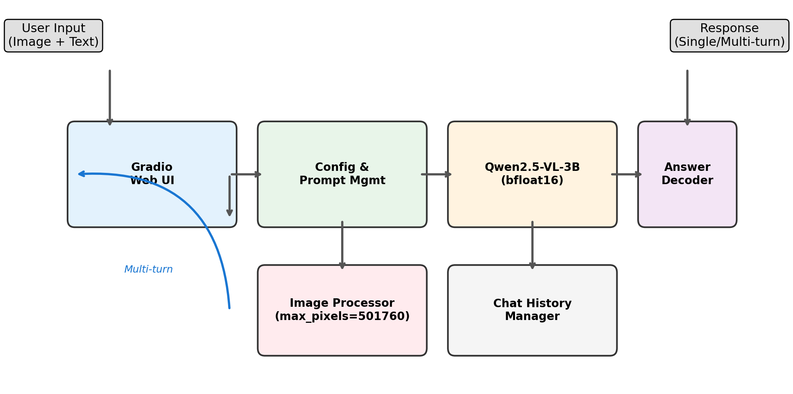
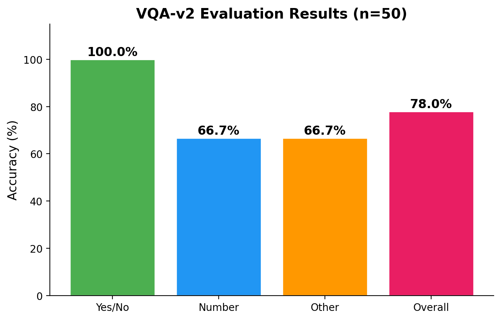
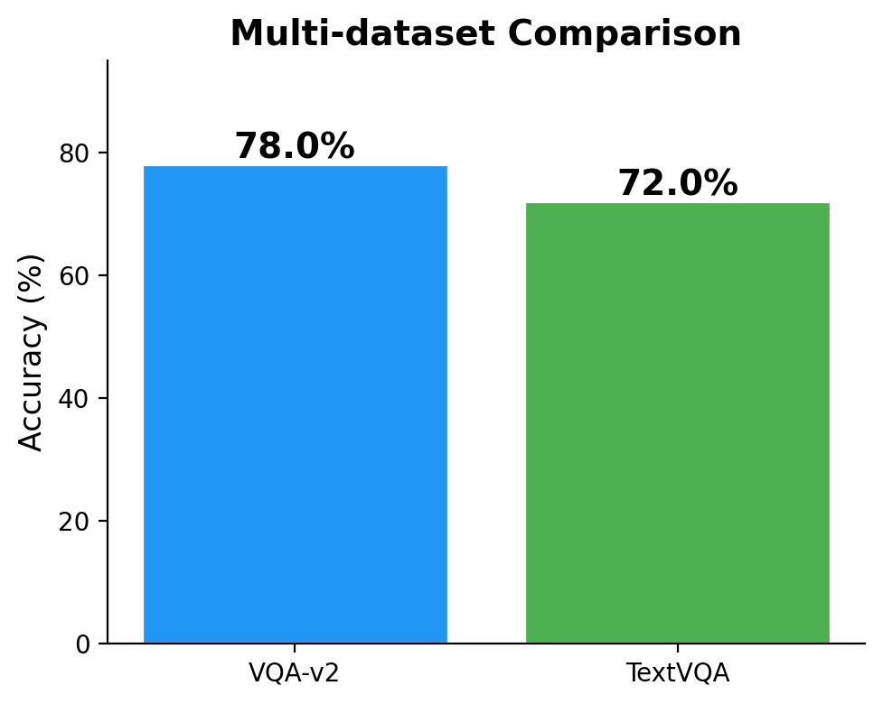
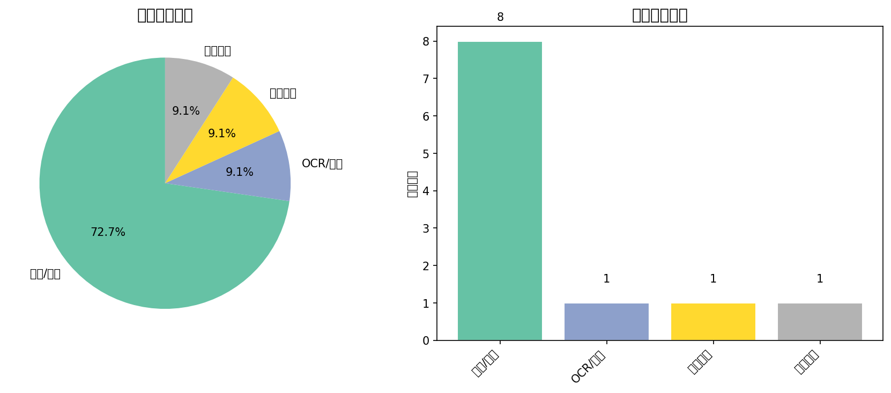

# 基于 VLM 的智能图文问答助手

**多模态大模型原理与应用 · 期末大作业答辩**

<div style="margin-top:40px;">

23336012 王泓皓 &emsp; 23336016 肖淇 &emsp; 23336006 韩冠东

计算机科学与技术专业 · 计算机学院

</div>

---

## 任务定义

**构建一个"看图/看文档能聊天"的多模态助手**

<div style="margin-top:20px;">

| 要素 | 说明 |
|------|------|
| 输入 | 图片 + 中文自然语言问题 |
| 输出 | 准确、简洁的中文回答 |
| 对话 | 基于同一张图片的多轮连续追问 |
| 场景 | 🖼️ 自然场景 + 📄 文档/幻灯片 |

</div>

**核心要求：**
- 至少两类图像（自然场景、文档/幻灯片）
- 中文问答与基础推理
- Web UI 或 CLI 交互界面
- 公开数据集定量评测 + 案例分析

---

## 系统架构



**四大核心模块：**
1. **Gradio Web UI** — 图片上传 + 多轮对话
2. **Config & Prompt 管理** — 三种场景 System Prompt
3. **Qwen2.5-VL-3B (bfloat16)** — 推理引擎，max_pixels=501760
4. **Chat History Manager** — 多轮上下文记忆

---

## 技术选型与系统实现

| 组件 | 选型 | 关键参数 |
|------|------|----------|
| 模型 | Qwen2.5-VL-3B-Instruct | bfloat16, ~6GB VRAM |
| 推理框架 | HuggingFace Transformers 4.51.0 | device\_map="auto" |
| 图像处理 | qwen\_vl\_utils 0.0.8 | min\_pixels=200704, max\_pixels=501760 |
| Web UI | Gradio 6.17.3 | server\_name="0.0.0.0" (WSL2适配) |
| 生成策略 | greedy decoding | do\_sample=False, repetition\_penalty=1.05 |

**代码仓库：** `github.com/Ceyo04/VLM-QA-Assistant`

**目录结构：** `src/inference/` (模型推理) · `src/ui/` (Gradio UI) · `src/eval/` (评测) · `src/data/` (流式加载) · `configs/` (配置分离)

---

## 推理管线与 Prompt 工程

**推理流程（四步）：**

| 步骤 | 操作 | 说明 |
|------|------|------|
| 1. 图像预处理 | `process_vision_info()` | max\_pixels=501760 限制分辨率 |
| 2. Chat Template | `apply_chat_template()` | Qwen2.5-VL 标准消息格式 |
| 3. 模型推理 | `model.generate()` | bfloat16, greedy, max\_new\_tokens=256 |
| 4. 答案解码 | `batch_decode()` | 去除输入 tokens，纯文本输出 |

**评测专用 Prompt（强制短答案）：**
```
Answer the question using a single word or short phrase.
Question: {question}
```
配合 `max_new_tokens=20` + `do_sample=False`，确保输出为单词/短语而非长句。

---

## 实验设计

| 项目 | 配置 |
|------|------|
| GPU | NVIDIA RTX 4060 (8GB VRAM) |
| CPU / RAM | Intel i5-12600KF / 32GB DDR4 |
| 环境 | WSL2 (Ubuntu), Python 3.12 |
| 评测数据集 | VQA-v2 (50条) · TextVQA (100条) · 自建中文集 (69 QA) |
| VQA 评测指标 | 标准软匹配（标注答案出现 ≥3 次且清洗后匹配） |
| 自建集指标 | 5 分制人工/自动评分 |
| 数据加载 | HuggingFace `streaming=True`（不落盘，防 VHDX 膨胀） |

---

## 实验结果 (1)：VQA-v2



| 问题类型 | 准确率 | 样本数 |
|----------|--------|--------|
| 是否类 (Yes/No) | **100.0%** | 17 |
| 计数类 (How many) | 66.7% | 9 |
| 其他 (What/Where) | 66.7% | 24 |
| **整体** | **78.0%** | **50** |

- Yes/No 满分：视觉判断能力可靠，Prompt 策略有效
- 计数 66.7%：3B 模型的固有能力边界

---

## 实验结果 (2)：TextVQA + 自建中文集

<div style="display:flex; gap:20px;">
<div style="flex:1;">

**TextVQA (100条)**
| 指标 | 数值 |
|------|------|
| 准确率 | **72.0%** |
| 正确数 | 72/100 |

侧重图像中文字识别：品牌名、路牌、数字

</div>
<div style="flex:1;">

**自建中文集 (69 QA)**
| 类别 | 均分 | ≥4分比例 |
|------|------|----------|
| 文档/幻灯片 | **4.40** | 85.0% |
| 自然场景 | 3.16 | 51.0% |
| **总计** | **3.52** | 60.9% |

5 张真实课程幻灯片，20 个中文问题

</div>
</div>

---

## 三数据集综合对比



| 数据集 | 样本数 | 成绩 | 核心能力 |
|--------|--------|------|----------|
| VQA-v2 | 50 | **78.0%** | 通用视觉问答 |
| TextVQA | 100 | **72.0%** | 图像文字阅读 |
| 自建中文集 | 69 QA | **3.52/5** | 中文文档理解 |

- 三个数据集覆盖了"自然场景视觉 + 文字阅读 + 中文文档"三个维度
- 文档类真实幻灯片表现突出（85% 高分率），证明 3B 模型具备实用级中文 OCR 能力

---

## 错误分析

**VQA-v2 剩余 11 个错误分类：**

| 错误类型 | 数量 | 占比 |
|----------|------|------|
| 推理/计数错误 | 8 | 72.7% |
| 视觉理解错误 | 1 | 9.1% |
| 知识缺失 | 1 | 9.1% |
| OCR/文字错误 | 1 | 9.1% |



**核心瓶颈：** 72.7% 为推理/计数错误 — 3B 模型在需要精细空间推理和关系判断时能力不足。修复评测管线后，基础视觉识别错误锐减至 9.1%。

---

## 案例研究

**成功案例：**
| 场景 | 问题 | 模型回答 | 结果 |
|------|------|----------|------|
| VQA | "Are the riders on the bikes?" | no | ✓ 10/10一致 |
| TextVQA | "what number is this bus?" | 477 | ✓ OCR精准 |
| 自建 | "中文版课本的出版社是什么？" | 电子工业出版社 | ✓ 中文满分 |

**失败案例：**
| 场景 | 问题 | 模型回答 | 正确答案 | 原因 |
|------|------|----------|----------|------|
| VQA | "What type of vehicle?" | car | truck | 细粒度分类 |
| TextVQA | "number on jersey?" | 28 | 22 | OCR小字误差 |
| 自建 | "标注样本数最少？" | 文本分类 | 情感分析 | 图表比较 |

---

## 反思与展望

**模型局限：**
- 3B 视觉编码器参数量瓶颈 — 细粒度识别和空间推理能力不足
- max\_pixels=501760 限制丢失细节信息（影响 OCR 精度）
- 缺乏外部知识源 — 知识依赖型问题表现弱
- 幻觉问题 — 不确定时倾向给出肯定回答

**改进方向：**
1. 升配硬件 → Qwen2.5-VL-7B（预期 +10~20pp 准确率）
2. RAG 外部知识检索 → 弥补 3B 知识短板
3. 独立 OCR 模块（PaddleOCR）→ 增强文档场景
4. 云 GPU LoRA 微调 → 本地适配器推理
5. 8-bit 量化探索 → 释放显存给更高分辨率输入

---

## AGI 视角：多模态理解的潜力与瓶颈

**潜力 ✓：**
- 统一感知与理解 — 多模态统一架构，无需管道式传输
- 零样本泛化 — 超越模式匹配的通用理解能力
- 交互式推理 — 多轮对话中的渐进式细化

**瓶颈 ✗：**
- 细粒度世界建模缺失 — 不理解物理因果（"推倒杯子会怎样"）
- 符号推理与感知脱节 — 无法进行"感知→计算→推理"链
- 持续学习能力缺失 — 知识截止于预训练时间点
- 可解释性不足 — 缺乏 Chain-of-Thought 推理追溯

**结论：** 当前 VLM 在感知层面已取得显著进展，但距 AGI 要求的"深度理解与推理"仍有根本性差距。

---

## 总结

<div style="margin-top:20px;">

| ✓ 已完成 | 详情 |
|-----------|------|
| 多模态问答系统 | Qwen2.5-VL-3B, bfloat16, 8GB 显存 |
| Web UI | Gradio 6.x, WSL2 适配, 多轮对话 |
| 三数据集评测 | VQA-v2 78% · TextVQA 72% · 自建 3.52/5 |
| 错误分析 | 系统性分类 + 可视化 + 典型案例 |
| 技术文档 | LaTeX 15页报告 + 8篇引用 + 完整代码 |

| 🔗 链接 | 地址 |
|-----------|------|
| 代码仓库 | github.com/Ceyo04/VLM-QA-Assistant |
| Demo 视频 | [B站/YouTube 链接] |

</div>

---

# 谢谢！欢迎提问
